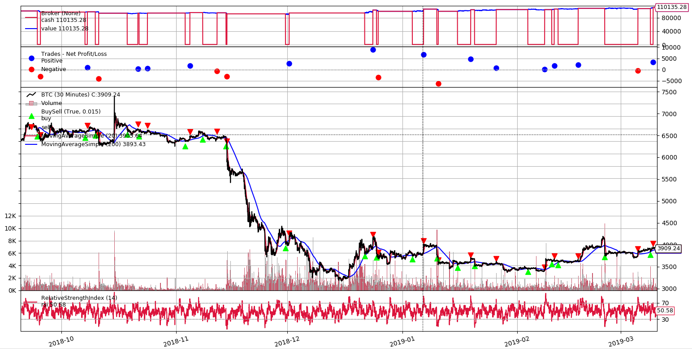

# Backtrader Binance Bot
A example of bot using Backtrader to trade Bitcoins in [Binance Exchange](https://www.binance.com/?ref=35723227).

Presentation in [TDC Belo Horizonte 2019](http://www.thedevelopersconference.com.br/tdc/2019/belohorizonte/trilha-python) (pt-BR)
- https://slides.com/rodrigo73/criptomoedas-tdc-2019

### Installation

Activating [Virtualenv](https://virtualenv.pypa.io/en/latest/)
```
make init
source venv/bin/activate
```

Installing dependencies
```
make install
```

Start application
```
./main.py
```

## Results




```
Starting Portfolio Value: 100000.00
Final Portfolio Value: 119192.61

Profit 19.193%
Trade Analysis Results:
               Total Open     Total Closed   Total Won      Total Lost     
               0              10             7              3              
               Strike Rate    Win Streak     Losing Streak  PnL Net        
               1              5              2              19192.61       
SQN: 1.75
```
